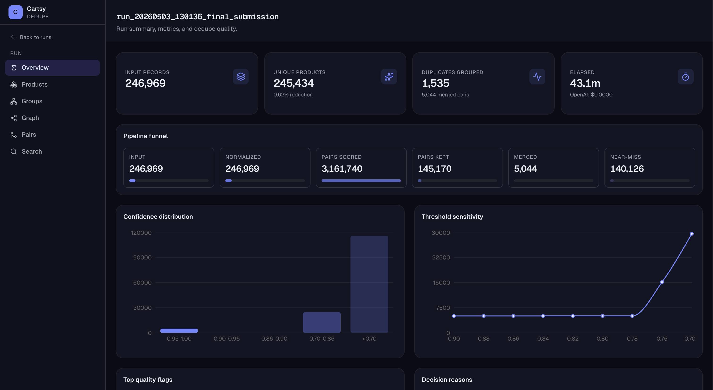
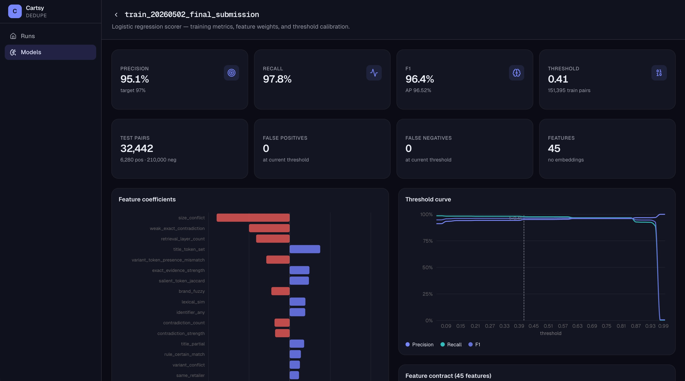

# Cartsy Dedupe Dashboard

Frontend for inspecting and analyzing Cartsy's product deduplication pipeline. Browse runs, explore dedupe groups and pairs, review model metrics, and visualize the product graph.

## Dashboard

Dedupe Runs



Model metrics



## Development

```bash
npm run dev
```

Open [http://localhost:3000](http://localhost:3000). Requires the backend API running on port 8000 (`docker compose up`).
